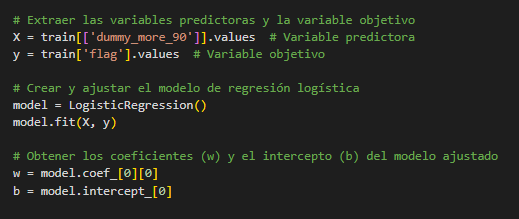
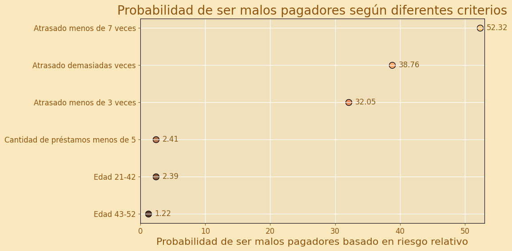

# Proyecto 3 - Banco Super Caja
# Riesgo Relativo

## Introducción

En respuesta al incremento de solicitudes de crédito debido a la reducción de tasas de interés, el banco "Super Caja" enfrenta una sobrecarga en su proceso manual de análisis de crédito. Este proyecto propone automatizar el análisis mediante técnicas avanzadas de datos para mejorar la eficiencia y precisión en la evaluación del riesgo crediticio. El objetivo es desarrollar un sistema de puntuación que clasifique a los solicitantes por riesgo, utilizando también en comparación de esta nueva métrica que se creará, una métrica existente que clasifica a los clientes entre buenos o malos pagadores, para optimizar las decisiones de concesión de crédito y reducir el riesgo de incumplimiento.


## Objetivos

* Identificar y tratar datos nulos, duplicados y outliers en el conjunto de datos.
* Crear nuevas variables y tablas auxiliares para mejorar la calidad y la riqueza del análisis.
* Calcular cuartiles para las variables de Edad y Cantidad de Préstamos para detectar posibles inconsistencias y entender la distribución.
* Segmentar la variable more_90_days_overdue para obtener insights sobre el comportamiento de los clientes en relación a su morosidad.
* Automatizar el proceso de análisis crediticio y desarrollar un nuevo score crediticio para evaluar el riesgo relativo.
* Incrementar la eficiencia operativa del banco y aliviar la sobrecarga del equipo de análisis de crédito.

## Integrante
* Osiris Berbesia

## Herramientas y Tecnologías
* SQL de BigQuery
* Visual Studio Code
* Markdown
* Google Console - Python
* Documentación de librerías Python:
  * Numpy
  * Matplotlib
  * Seaborn
  * Pandas
* OpenAI - ChatGPT
* Google Slides


## Procesamiento y análisis

* [Análisis de datos nulos](nulos.md), sustitución de nulos por promedios de sus respectivas variables.
* Datos duplicados en variables de datos únicos, no encontrados.
* Cálculo de cuartiles para las variables que serán estudiadas. (Edad, cantidad de préstamos y conteo de atrasos mayores a 90 días)
* Se realiza la [estandarización de datos](estandarizacion.md) para el tipo de préstamos, y el conteo de las mismas.
 * Se realiza [la correlación entre las variables](correlacion.md) que miden los atrasos entre 30-59 días, 60-89 días y más de 90 días, resultando en una correlación positiva, casi perfecta.
 * Una vez creado los cuartiles se calcula el riesgo relativo de la posibilidad de ser un mal pagador de un grupo de personas, en comparación con los otros grupos de su misma naturaleza. (Es decir, cuartil de edad 1, versus los otros cuartiles de edad)
* Para la regresión logística, se tomó en cuenta el dato default_flag para el entrenamiento del modelo.

  Ejemplo:


  


Obteniendo así, el coeficiente y el intercepto.

## Creación de nuevas variables
Las nuevas variables creadas fueron:

* edad_cuartil: división de las edades según cuartiles, donde:
  * edad <= 42 sería Cuartil 1 
  * edad <= 52 sería Cuartil 2 
  * edad <= 63 sería Cuartil 3 
  * edad >= 64 sería Cuartil 4 

* dummy_edad: variable de 0 y 1 que identifica si la edad para esta persona es una edad de riesgo o no.

* lines_category_using: variable que indica el nivel de uso de las lineas de crédito, desde Muy Bajo Uso hasta Alto Uso.

* debt_r_categoria: variable que identifica si el perfil actual del cliente es de riesgo o no, desde cliente "Muy Seguro" hasta "Alto Riesgo".

* categoria_more90: Segmentación categórica para la cantidad de atraso de más de 90 días del cliente donde:
  * Cuando la cantidad de veces atrasados = 0 entonces la variable categorica indica: "Sin atrasos de más de 90 días"
  * Cuando la cantidad de veces atrasados < 3 entonces la variable categorica indica: "Atrasado menos de 3 veces"
  * Cuando la cantidad de veces atrasados <= 7 entonces la variable categorica indica: "Atrasado menos de 7 veces"
  * Cuando la cantidad de veces atrasados >= 8 entonces la variable categorica indica: "Atrasado demasiadas veces"
* dummy_more_90: variable de 0 y 1 que identifica si la cantidad de veces atrasado para esta persona es de riesgo o no.
* acumulado_atrasos: sumatoria de las 3 variables de atrasos por cliente.
categoria_atrasos: identifica cuantas veces se ha atrasado un cliente (si se ha atrasado), y en cuales momentos han sido sus mayores atrasos.
* grupo_pago: variable cualitativa de default_flag
* total_loans: total de préstamos del cliente
* cuartil_total_loans: segmentación de la cantidad de deudas del cliente
* dummy_total_loans: variable de 0 y 1 que identifica si la cantidad de deudas para esta persona es de riesgo o no.
* dummy_score: concatenado de todas las dummies.
* score: variable categórica que identifica como mal pagador, o buen pagador a un cliente basado en el concatenado de sus dummies.
Código:
```sql
  CASE
    WHEN CAST (
      concat (a.dummy_more_90, 
      IF (b.cuartil_total_loans = "Cuartil 1 (0-5)", 1,0), 
      a.dummy_edad) AS int64) = 000       THEN "Buen pagador"
    WHEN CAST (
      concat (a.dummy_more_90, 
      IF (b.cuartil_total_loans = "Cuartil 1 (0-5)", 1,0), 
      a.dummy_edad) AS int64) = 001       THEN "Buen pagador"
    WHEN CAST (
      concat (a.dummy_more_90, 
      IF (b.cuartil_total_loans = "Cuartil 1 (0-5)", 1,0), 
      a.dummy_edad) AS int64) = 010       THEN "Buen pagador"
    WHEN CAST (
      concat (a.dummy_more_90, 
      IF (b.cuartil_total_loans = "Cuartil 1 (0-5)", 1,0), 
      a.dummy_edad) AS int64) = 011       THEN "Buen pagador"    
    WHEN CAST (
      concat (a.dummy_more_90, 
      IF (b.cuartil_total_loans = "Cuartil 1 (0-5)", 1,0), 
      a.dummy_edad) AS int64) = 100       THEN "Mal pagador"
    WHEN CAST (
      concat (a.dummy_more_90, 
      IF (b.cuartil_total_loans = "Cuartil 1 (0-5)", 1,0), 
      a.dummy_edad) AS int64) = 101       THEN "Mal pagador"
    WHEN CAST (
      oncat (a.dummy_more_90, 
      IF (b.cuartil_total_loans = "Cuartil 1 (0-5)", 1,0), 
      a.dummy_edad) AS int64) = 110       THEN "Mal pagador"
    WHEN CAST (
      concat (a.dummy_more_90, 
      IF (b.cuartil_total_loans = "Cuartil 1 (0-5)", 1,0), 
      a.dummy_edad) AS int64) = 111       THEN "Mal pagador"
    ELSE "A_Error"
END
  AS score
  ```
* conteo_others: conteo total de otros tipos de préstamos del cliente
* conteo_real_estate: conteo total de préstamos inmobiliarios del cliente


## Unificación de tablas

Posterior a la creación de las diferentes variables, la tabla unificada, maneja la siguiente información:

| Nombre del campo             | Tipo    | Modo    | Clave | Intercalación | Valor predeterminado | Etiquetas de políticas | Descripción |
|------------------------------|---------|---------|-------|---------------|-----------------------|------------------------|-------------|
| id_usuario                   | INTEGER | NULLABLE| -     | -             | -                     | -                      | -           |
| edad                         | INTEGER | NULLABLE| -     | -             | -                     | -                      | -           |
| edad_cuartil                  | STRING  | NULLABLE| -     | -             | -                     | -                      | -           |
| dummy_edad                   | INTEGER | NULLABLE| -     | -             | -                     | -                      | -           |
| salario                      | INTEGER | NULLABLE| -     | -             | -                     | -                      | -           |
| dependents                   | INTEGER | NULLABLE| -     | -             | -                     | -                      | -           |
| using_lines_not_secured      | FLOAT   | NULLABLE| -     | -             | -                     | -                      | -           |
| lines_category_using         | STRING  | NULLABLE| -     | -             | -                     | -                      | -           |
| deudas_sobre_patrimonio      | FLOAT   | NULLABLE| -     | -             | -                     | -                      | -           |
| debt_r_categoria             | STRING  | NULLABLE| -     | -             | -                     | -                      | -           |
| delay_30_59                  | INTEGER | NULLABLE| -     | -             | -                     | -                      | -           |
| delay_60_89                  | INTEGER | NULLABLE| -     | -             | -                     | -                      | -           |
| delay_more_90                | INTEGER | NULLABLE| -     | -             | -                     | -                      | -           |
| categoria_more90             | STRING  | NULLABLE| -     | -             | -                     | -                      | -           |
| dummy_more_90                | INTEGER | NULLABLE| -     | -             | -                     | -                      | -           |
| acumulado_atrasos            | INTEGER | NULLABLE| -     | -             | -                     | -                      | -           |
| categoria_atrasos            | STRING  | NULLABLE| -     | -             | -                     | -                      | -           |
| flag                         | INTEGER | NULLABLE| -     | -             | -                     | -                      | -           |
| grupo_pago                   | STRING  | NULLABLE| -     | -             | -                     | -                      | -           |
| total_loans                  | INTEGER | NULLABLE| -     | -             | -                     | -                      | -           |
| cuartil_total_loans          | STRING  | NULLABLE| -     | -             | -                     | -                      | -           |
| dummy_total_loans            | INTEGER | NULLABLE| -     | -             | -                     | -                      | -           |
| dummy_score                  | STRING  | NULLABLE| -     | -             | -                     | -                      | -           |
| score                        | STRING  | NULLABLE| -     | -             | -                     | -                      | -           |
| conteo_others                | INTEGER | NULLABLE| -     | -             | -                     | -                      | -           |
| conteo_real_estate           | INTEGER | NULLABLE| -     | -             | -                     | -                      | -           |

## Resultados y Conclusiones

### Riesgo relativo

#### Probabilidad de ser malos pagadores según diferentes criterios

Para visualizar la probabilidad de ser malos pagadores según diferentes criterios, se puede usar el siguiente enfoque:

#### Datos
Se han considerado diferentes criterios y sus respectivas probabilidades:

- Edad 43-52: 1.22
- Edad 21-42: 2.39
- Cantidad de préstamos menos de 5: 2.41
- Atrasado menos de 3 veces: 32.0506684131448
- Atrasado demasiadas veces: 38.7593619380705
- Atrasado menos de 7 veces: 52.3212669683258

#### Configuración del gráfico
- Se utiliza un gráfico de dispersión para visualizar estos datos.
- Los puntos se colorean con un gradiente que va de anaranjado a café oscuro.
- Los puntos tienen un borde negro para mayor visibilidad.





## Recomendaciones, Limitaciones y Próximos Pasos

### Recomendaciones
1. **Edad del Cliente**:
   - Verificar y corregir edades anómalas (por ejemplo, mayores a 100 años).
   - Registrar el año de nacimiento en lugar de la edad directamente.

2. **Último Salario Mensual**:
   - Implementar control para evitar valores excesivamente bajos o cero.
   - Añadir validación para valores extremos y permitir actualizaciones precisas.

3. **Número de Dependientes**:
   - Desglosar en categorías detalladas como "Número de hijos" y "Número de otros dependientes".

4. **Tipo de Préstamo**:
   - Ampliar categorías para incluir tipos como "personal", "inversión", "emprendimiento", "familiar", "automóvil".
   - Revisar y actualizar regularmente.

5. **Uso de Líneas No Aseguradas**:
   - Validar que los valores estén en el rango esperado (0 a 1).
   - Establecer límites para valores extremos.
   - Implementar controles para datos anómalos (Auditorías).

6. **Relación Deuda/Patrimonio**:
   - Asegurar valores dentro del rango esperado (0 a 1).
   - Revisar y corregir datos anómalos y establecer controles para entradas incorrectas.

### Limitaciones

La verificación de edades y la definición de valores extremos en los salarios mensuales presentan desafíos técnicos importantes. La falta de información adicional para corregir edades anómalas (por ejemplo, edades mayores a 100 años) puede llevar a datos inexactos. Asimismo, definir claramente qué se considera un "valor extremo" en los salarios es complejo y podría resultar en la inclusión de datos inexactos si no se maneja adecuadamente. Además, desglosar el número de dependientes en categorías detalladas puede complicar la recolección de datos precisos, lo que podría resultar en información incompleta.

Y esto mismo con otros datos y otras variables, donde si bien es cierto, los datos fuera de rango o atípicos, se podrían analizar mejor teniendo claro la visión de la empresa respecto a estos valores.


### Próximos Pasos

1. **Edad del Cliente**:
   - Implementar un sistema de verificación automática para detectar edades anómalas.
   - Modificar la base de datos para registrar las fecha de nacimiento en lugar de solo la edad.

2. **Último Salario Mensual**:
   - Desarrollar un mecanismo de validación y actualización de valores salariales.
   - Establecer un umbral mínimo aceptable para el salario mensual.

3. **Número de Dependientes**:
   - Crear nuevas categorías en la base de datos para diferenciar entre "Número de hijos" y "Número de otros dependientes".

4. **Tipo de Préstamo**:
   - Realizar un análisis del mercado para identificar nuevas categorías de préstamos relevantes.
   - Actualizar la base de datos y el sistema de registro para incluir estas nuevas categorías.

5. **Uso de Líneas No Aseguradas**:
   - Definir y establecer un rango aceptable para el uso de líneas no aseguradas.
   - Implementar auditorías periódicas para detectar y corregir datos anómalos.

6. **Relación Deuda/Patrimonio**:
   - Establecer un rango como aceptable para la relación deuda/patrimonio.
   - Desarrollar un protocolo de revisión y corrección para entradas incorrectas.
   - Analizar con el departamento de desarrollo un a limitación dentro del sistema para ciertos datos.
   - Si esta variable no es ingresada por nadie, sino es resultado de un cálculo, crear una variable adicional donde se mida si el cálculo es el esperado o no para así controlarlo.

   
## Enlaces de interés

 * [Presentación  ](https://docs.google.com/presentation/d/18CIAZbbIOaBr2n0FJDfhwaYs2Gms7CU3ID2MP2vReUU/edit?usp=sharing)
* [Video de Loom](https://www.loom.com/share/3571516cc7c04f9da78954e6417f2885?sid=18887e38-09cb-4ac8-ac28-eb4e3bd8cbf1)
* [Dashboard](https://lookerstudio.google.com/reporting/50fe9bb0-2725-45e5-9409-f1c85a452bf7)
* [Repositorio](https://github.com/osirisberbesia/laboratoria-riesgo-relativo)
